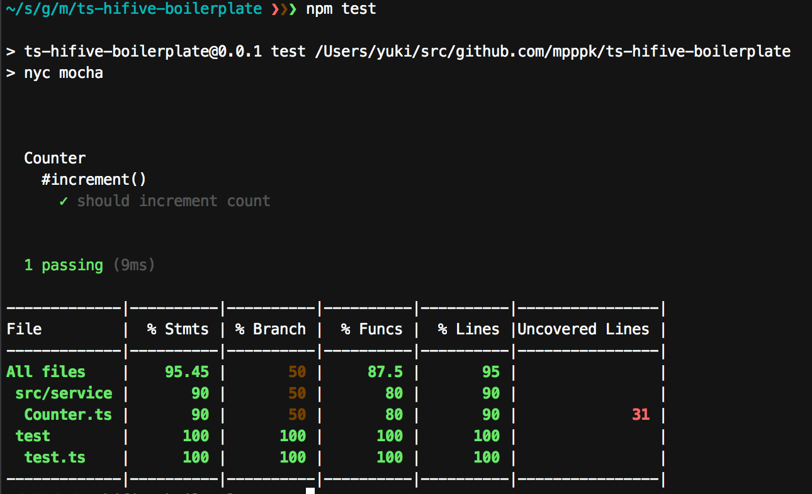
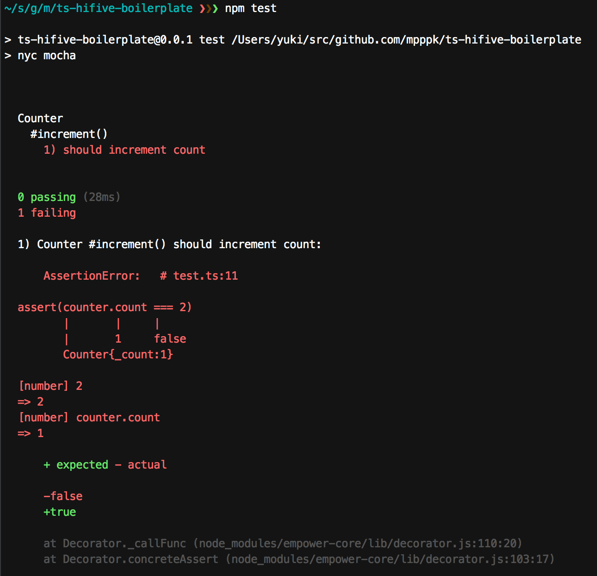
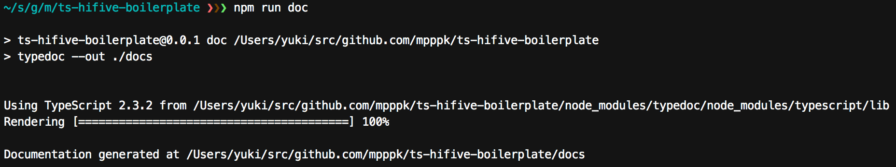
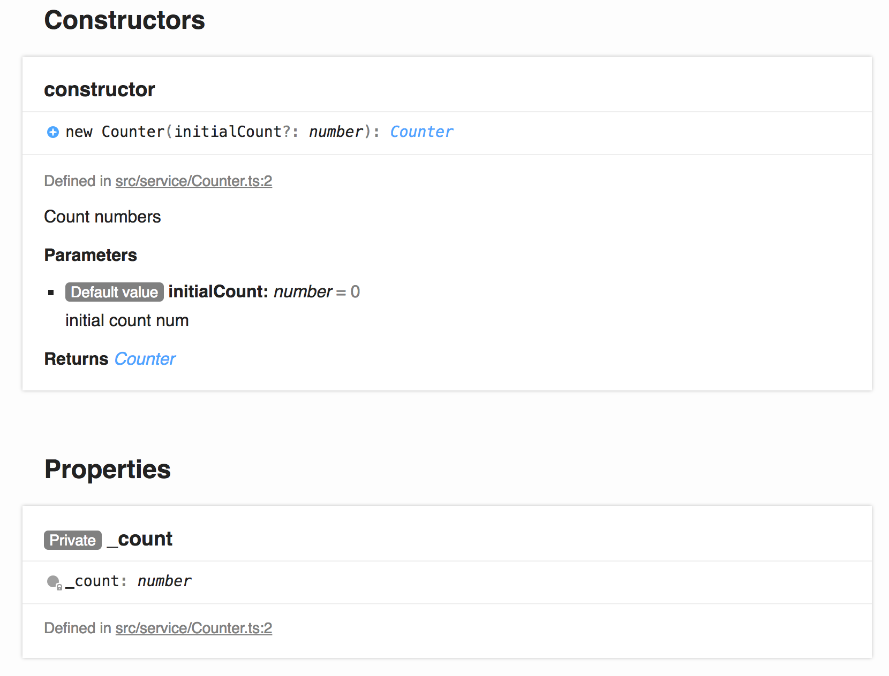
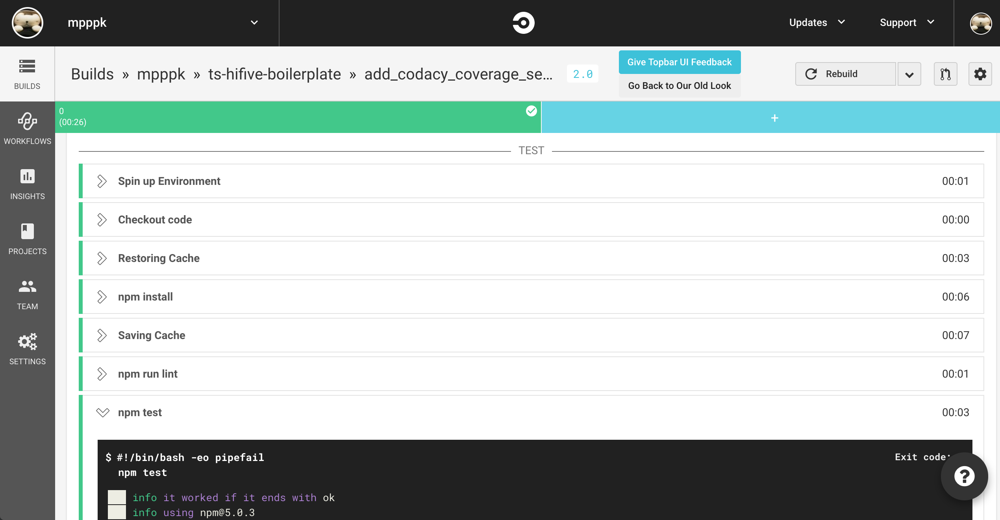
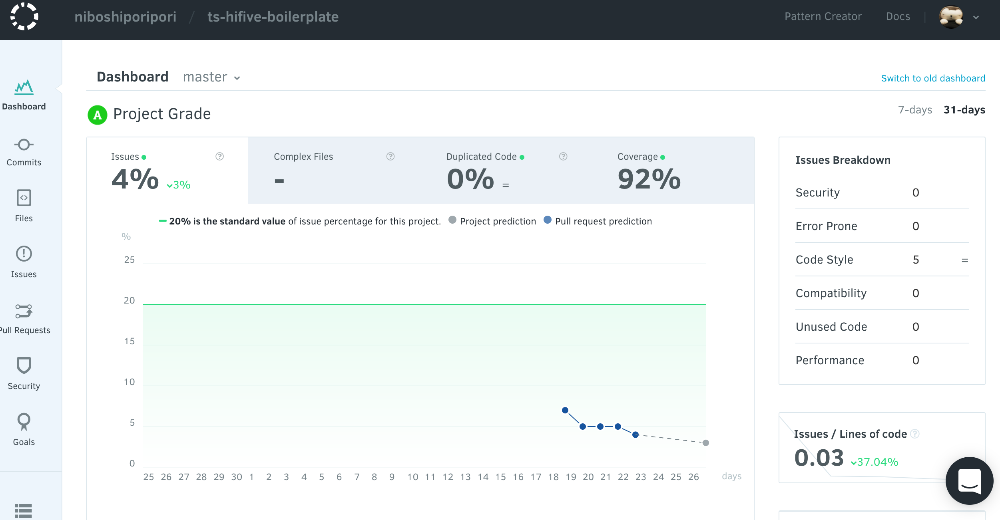
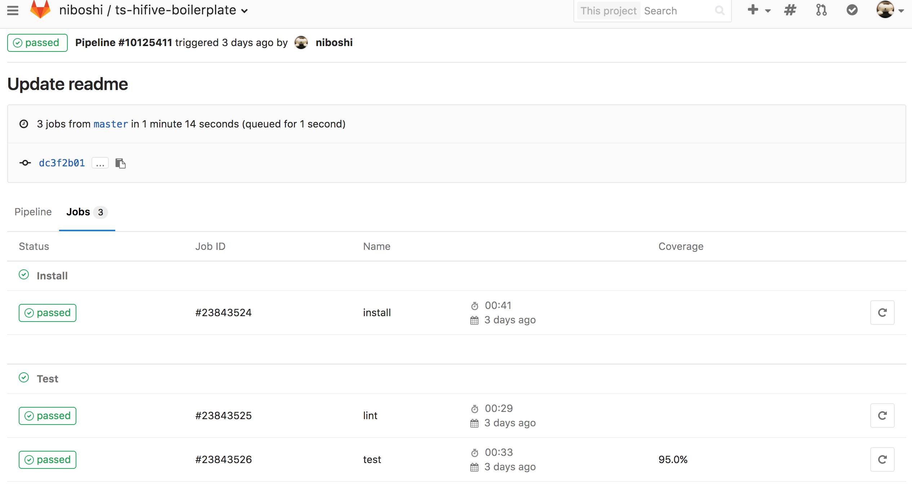

# TypeScript + hifive boilerplate

[](https://greenkeeper.io/)
[](https://circleci.com/gh/mpppk/ts-hifive-boilerplate)
[](https://www.codacy.com/app/niboshiporipori/ts-hifive-boilerplate?utm_source=github.com&amp;utm_medium=referral&amp;utm_content=mpppk/ts-hifive-boilerplate&amp;utm_campaign=Badge_Grade)

### GitLab Badges

[](https://gitlab.com/mpppk/ts-hifive-boilerplate/commits/master)
[](https://gitlab.com/mpppk/ts-hifive-boilerplate/commits/master)

## Installation

```Shell
$ git clone https://github.com/mpppk/ts-hifive-boilerplate.git
$ npm install
```

## Usage
### Start server for development

```Shell
$ npm start
```

`npm start` serve your application on `http://localhost:8080` and updates the browser on changes.    


#### Ref
* [webpack-dev-server](https://github.com/webpack/webpack-dev-server)  

### Testing

```Shell
$ npm test
```

`npm test` execute the test of `test/**/*.ts` and output the coverage.



If test failed, detailed error message will be displayed.



#### Ref
* [mocha](https://mochajs.org)
* [nyc](https://github.com/istanbuljs/nyc)
* [power-assert](https://github.com/power-assert-js/power-assert)

### Linting

```Shell
$ npm run lint
```

`npm run lint` execute linting.


#### Ref
* [tslint](https://palantir.github.io/tslint/)

### Generate Documentation

```Shell
$ npm run doc
```

`npm run doc` generate documentation to `docs/`.





#### Ref
* [typedoc](https://github.com/TypeStrong/typedoc)

## Tools
* editorconfig

## SaaS Integration
### Circle CI



### Codacy



## GitLab Integration
* GitLab CI & Coverage


